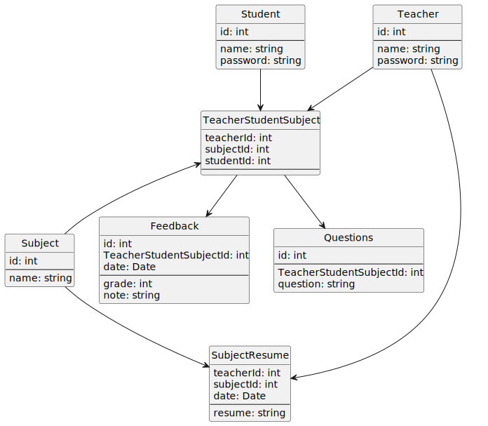

# 2024-2-CC4401-grupo-6

## Contextualización
Este repo contiene una aplicación desarrollada con el framework de Django, la cual permitiría a estudiantes de enseñanza media, poder realizar feedback a sus profesores de manera anónima tras cada clase.

La idea de este feedback es que se anonimo desde un estudiante cualquiera, por lo que ni otros compañeros ni el profesor podrían saber quien mando el feedback o la pregunta. Por otro lado de igual manera se mantiene el feedback identificable para un administrador del sistema con el fin de poder mantener una responsabilidad con la opinión emitida.

## Como inicializar el ambiente de trabajo
Como ya se dijo esta aplicación trabaja con el framework de Django. En la siguiente sección podrá ver como configurar su ambiente de trabajo para poder probar la aplicación.

Primero bajamos el proyecto desde github hacia nuestra maquina local y cambiamos a la carpeta donde este proyecto será almacenado para poder trabajar.

```bash
git clone git@github.com:DCC-CC4401/2024-2-CC4401-grupo-6.git feedback
cd feedback
```

Luego nos aseguramos de installar virtualenviroment para poder trabajar con las versiones y las dependencias del proyecto sin necesitar installar todo directamente en nuestra maquina.
```bash
pip install virtualenv
```

Ocupamos el siguiente commando para poder crear nuestro virtual evironment, es muy importante recordar que para mayor comodidad este comando debe ser corrido en la carpeta raiz de donde normalmente estaremos trabajando.
```bash
python -m venv venv
```

Luego activamos nuestro virtual environment para poder trabajar con este mismo.

En caso de usar Linux:
```bash
source venv/bin/activate
```

En caso de usar Windows:
```bash
venv\Scripts\activate
```

Finalmente, una vez dentro de nuestro virtual environment, instalamos todas las dependencias necesarias para poder trabajar con el proyecto ejecutando el siguiente comando.

```bash
pip install -r requirements.txt
```

Con esto nuestro proyecto esta listo para poder trabajar. Cada vez que queramos ejecutar nuestro proyecto deberemos activar el virtual environment como se mostro anterior mente y si luego queremos cerrar este, simplemente cerramos la terminal o ejecutamos:

```bash
deactivate
```

## Modelo de datos

En el siguiente diagrama se muestra el modelo de datos que manejamos actualmente en la aplicacion con sus dependencias y llaves foraneas.


